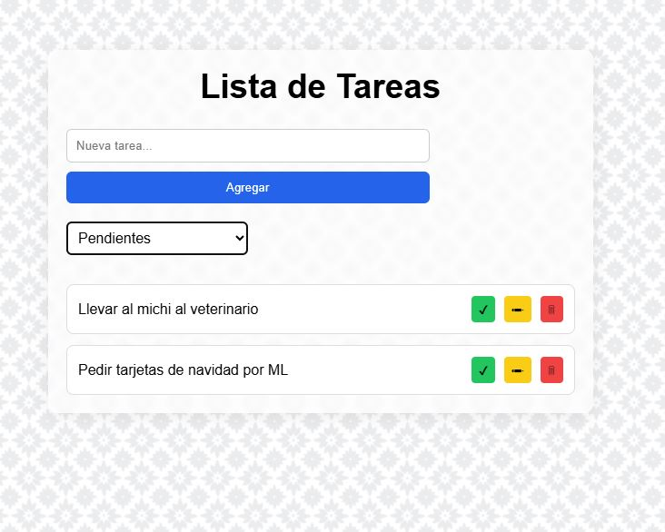

# Aplicación Todo List — React

## Descripción de mi proyecto:
Es una aplicación de gestión de tareas desarrollada en **React con Vite**.  
Permite crear, editar, completar, eliminar y filtrar tareas.  
Todas las tareas se guardan automáticamente en **localStorage**, por lo que permanecen incluso si se recarga la página.

El diseño es simple y responsive, con estilos personalizados.
---

## 💡 Funcionalidades principales:
- Agregar nuevas tareas mediante un input con validación.
- Editar tareas en línea.
- Marcar tareas como completadas (las muestro tachadas).
- Eliminar tareas con confirmación.
- Filtrar tareas por:
  - **Todas**
  - **Completadas**
  - **Pendientes**
- Guardado automático en `localStorage` usando `useEffect`.
- Interfaz responsive.

---

## 🛠 Tecnologías utilizadas
- **React (Vite)**
- **JavaScript**
- **CSS** 
- **localStorage**

---

## 📂 Estructura de mi proyecto:

/src
/components
Form.jsx
TodoList.jsx
Todo.jsx
App.jsx
main.jsx
index.css

/public
favicon.png
moroccan-flower.png


## ¿ Cómo ejecutar el proyecto localmente?

### 1. Instalar dependencias
```bash
npm install

### 2. Ejecutar el servidor de desarrollo
npm run dev

### 3. Crear build de producción
npm run build

### 4. Previsualizar el build
npm run preview


## ¿ Cómo verificar la persistencia en localStorage

Abrir la aplicación en el navegador.

Crear o editar tareas.

Abrir DevTools:
Application → Local Storage → (tu dominio) → clave: todos

Ver que los datos cambien en tiempo real.

Refrescar la página y confirmar que las tareas siguen allí.


### Pantalla inicial


### Pantalla con filtros y editado



### Pantalla con error


